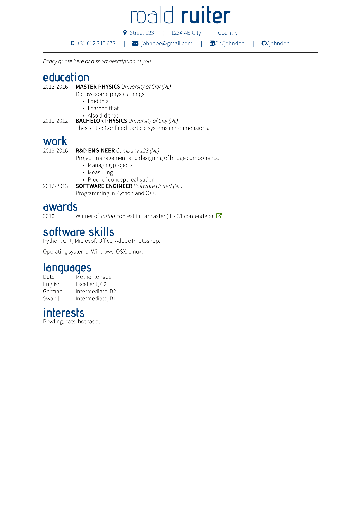

# CV template for XeLaTeX

A modification of the [XeLaTeX CV Roald](https://github.com/Roald87/xelatex-cv-roald/) template
where the header is changed not to be a solid colour.
This version should be less expensive for printing.